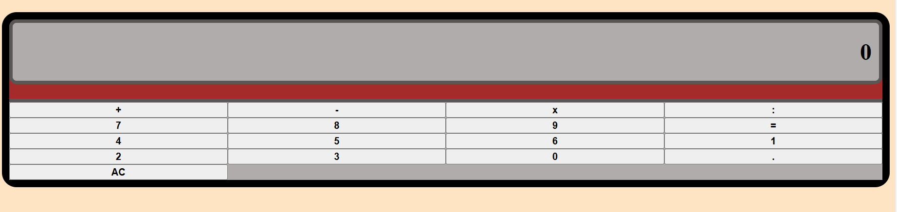

# calculadora01
 ## projeto de uma calculadora que faz contas básicas

### Primeiramente, usei como base o seguinte esquema de calculadora:

### Esta imagem é do site FreeCodeCamp que ensina como fazer uma calculadora com HTML, CSS e Javascript, mas assim como é sugerido no site, primeiramente estou tentando fazer sem olhar a resposta e seguindo a disposição de teclas como na imagem acima 

## Funcionamento da calculadora:

### basicamente, o programa da calculadora precisa "ouvir" as teclas com os números e as teclas que possuem os operadores aritméticos quando o usuário clica os botões, realizar o cálculo necessário e mostrar o resultado no display

há uma seção que é separada por uma tag div no htlm que engloba a calculadora no geral, uma div para cuidar do display, uma div para cuidar dos botôes e dentro dela mais uma **div class="calculadora_botoes"** que cuida diretamente dos botões da calculadora sendo então a classe calculadora_botoes onde está a tag pai dos botões.
Como está caixa (div) cuida diretamente dos botões da calculadora, então é nela em que será feita a configuração para que os botões fiquem posicionados no formato de grade. Isso é feito usando o **CSS Grid Layout** para criar um método bidimensional com linhas e colunas, fazemos isso dizendo que essa tag pai é um grid layout no nosso arquivo CSS:

agora que a div referente a esta classe **class="calculadora_botoes** se tornou um display grid, todos os seus filhos, nocaso as tags button referente aos botões da calculadora se tornam **grid items**

Neste momento, a aparência está desta forma:

Como podemos observar pela imagem, mesmo dizendo que se trata de um grid, está se comportando ainda como uma lista com item abaixo de item, no caso botão abaixo de botão. Para deixarmos como com linhas e colunas, vamos definir as **trilhas de colunas** usando a propriedade **grid-template-columns**

Aqui está sendo dito a partir desta propriedade grid-template-columns que é necessário formar 4 colunas de 1fr cada uma, por isso foi repetido o valor quatro vezes. A unidade de medida fr seria uma fração do espaço disponível no grid.
Depois disso, o resultado fica desta forma:

Como as linhas estão um tanto quanto pequenas, vamos mudar seu tamanho a partir da propriedade **grid-auto-rows** que define o tamanho padrão para as linhas criadas no grid e aqui será colocoado o valor de 50px:

E as linhas dos grid items ou botões da calculadora ficam maiores:

Como podemos ver na imagem inicial que está sendo usada como base, a disposição dos botões no grid ainda não está igual. O botão que representa o sinal de = tem um tamanho e disposição diferente dos demais. Então para tratar isso, fiz uma classe específica para ele no html para que este botão possa ter sua própria estilização

